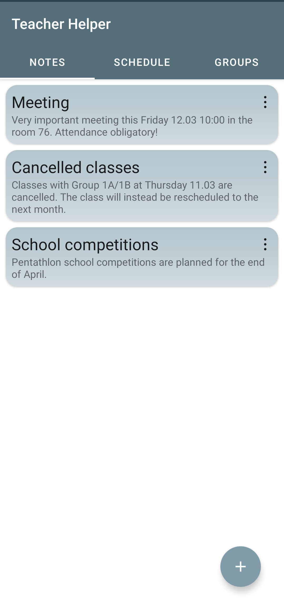
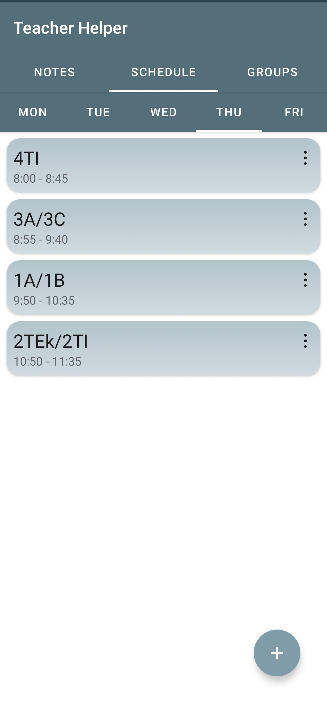
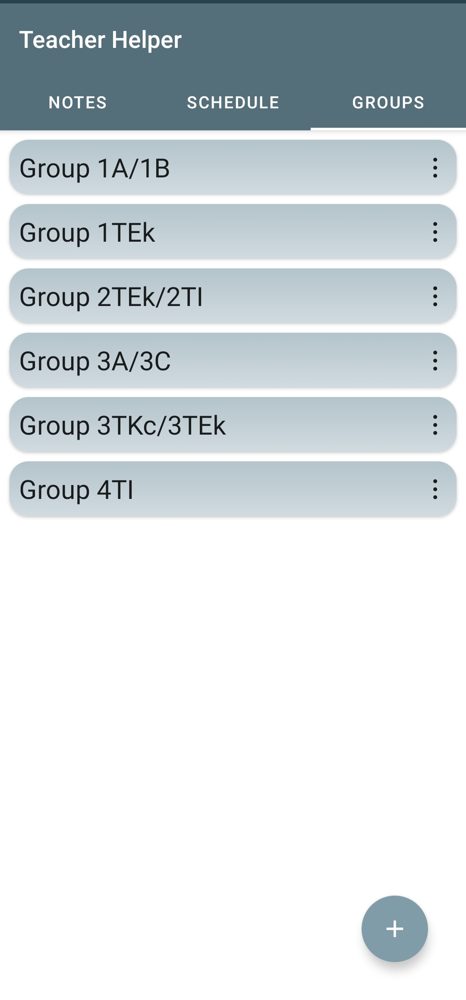
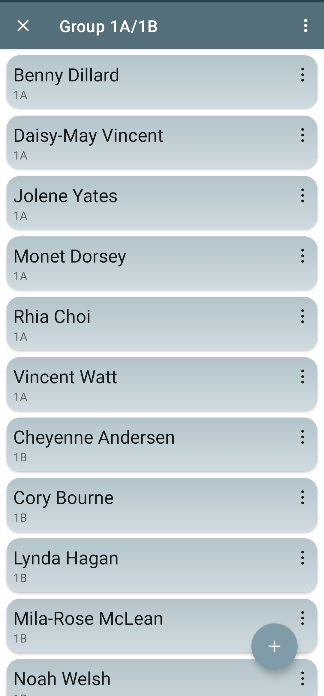
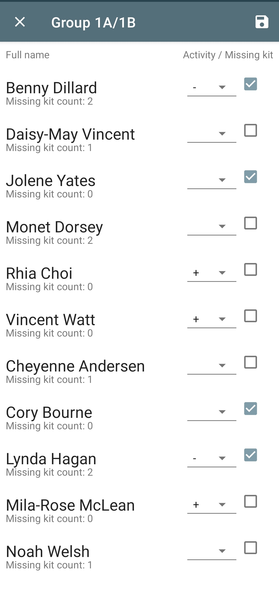
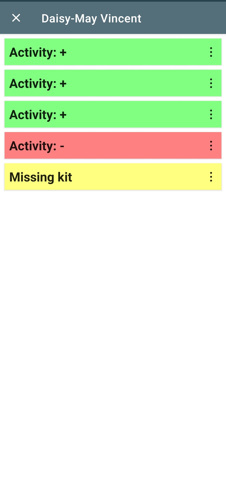

# Teacher Helper
> *Teacher Helper* is an Android application I created for **my father** who is a **physical education teacher** and needs a simple way to store and create quick-access information.

## General info
The application is made with my father and his work in mind, so it is targeted at a very specific problem, thus it is not a universal application for teachers. The app lets You store notes, schedule for each workday, groups of students and information about those students like their activities (positive or negative activity and missing PE kit).

## Screenshots

	
	
	
	
	
	

## Setup
* Download [teacher-helper-android-signed.apk](https://github.com/sweakpl/teacher-helper/releases),
* Put it e.g. in a `Downloads` folder in Your Android device,
* Go to the `Downloads` folder on the Android device,
* Tap the file and install - the app doesn't require any special permissions.

## Icons attribution
* Icons made by [Freepik](https://www.freepik.com) from [Flaticon](https://www.flaticon.com)